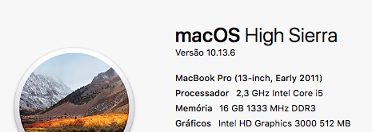

My macOS developer configuration
================================

É assim que configuro meu macOS para desenvolvimento.

## Meu hardware



## O que já temos pronto?

Como um desenvolvedore de software, no macOS já temos várias ferramentas prontas
sem precisar de nenhuma instalação adicional. É só começar a desenvolver:

- Ruby (https://www.ruby-lang.org)
- Perl 5 (https://www.perl.org)
- Python 2 (https://www.python.org)
- Apache 2 (https://www.apache.org)
- PHP 7 (https://www.php.net)
- cURL (https://curl.haxx.se)
- Emacs 22 (https://www.gnu.org/software/emacs)
- Vim 8 (https://www.vim.org)
- OpenSSL/LibreSSL (https://www.libressl.org, https://www.openssl.org)
- SQLite3 (https://www.sqlite.org)
- Swift (https://swift.org)
- Tcl/Tk 8.5 (https://www.tcl.tk)

Além, é claro, de ser um UNIX (http://www.unix.org), e por isso tem inúmeras outras
ferramentas que podemos usar no dia-a-dia, tais como (yacc, gnumake, tar, unzip, etc.).

## E o que precisamos mais?

Como desenvolvedor de múltiplas linguagens, mesmo já tendo toda essa lista
de linguagens apresentada lá em cima, ainda me falta as ferramentas para desenvolvimento
nativo. Além é claro de algumas dessas ferramentas estarem com versões antigas.

Assim, precisamos instalar os compiladores para código nativo, e isso pode ser
feito com o comando `xcode-select --install`. Porém, nós também precisaremos atualizar
as versões dos softwares já instalados e instalar outros, e para isso eu utilizo o
Homebrew (https://brew.sh). Ao instalar o Homebrew, ele já instala as ferramentas
nativas que seriam instaladas com o comando `xcode-select --install`, portanto não
precisaremos executá-lo separadamente.

Então instale o Homebrew seguindo as instruções de https://brew.sh.
Quando a instalação terminar, nós teremos além do próprio comando `brew`,
também os compiladores nativos:

- Compiladores **C**: clang, gcc, cc, c89, c99
- Compiladores **C++**: clang++, g++, c++, cpp

Já não temos porque reclamar, como desenvolvedor, temos agora um arsenal de ferramentas
de desenvolvimento das mais variadas tecnologias e plataformas disponíveis só aguardando
nossa codificação.

Mas ainda precisamos de mais algumas ferramentas, e utilizaremos o Homebrew para
instalá-las:

## Primeiramente vamos atualizar nossas ferramentas já instaladas

### Ruby

Já temos o Ruby `v2.3` que vem com o `gem 2.5`, e queremos usar a última versão
disponível:
```
$ brew install ruby
```

Trabalhar com duas versões do Ruby pode causar alguns probleminhas, por isso
o `brew` não atualiza os links e se você tentar executar `ruby` em seu
terminal, verá que lá ainda está a versão `2.3`. Mas basta você atualizar
sua variável de ambiente `$PATH` para resolver o problema:
```
$ echo 'export PATH="/usr/local/opt/ruby/bin:$PATH"' >> ~/.bashrc
```

Agora temos o Ruby `v2.6` com o `gem 3.0` disponível.

### ~/.bashrc e ~/.bash_profile

Não quero aqui entrar na discussão das diferenças entre os arquivos de
configuração `~/.bash_profile` e `~/.bashrc`, então deixo esse link para você
saber mais sobre o assunto:
https://medium.com/@kingnand.90/what-is-the-difference-between-bash-profile-and-bashrc-d4c902ac7308

Mas eu uso a seguinte configuração na minha máquina:

Tenho o arquivo `~/.bashrc` e uso somente ele para configurar minhas variáveis
de ambiente e personalizações.

Mas também tenho o arquivo `~/.bash_profile` para as configurações iniciais de logon,
esse por sua vez inclui `~/.bashrc` para as configurações de variáveis de ambiente
e personalizações.
```sh
$ ~./bash_profile << EOF
# Include ~/.bashrc if exists
if [ -f ~/.bashrc ]; then
    source ~/.bashrc
fi
EOF
```

### Perl

O Perl que vem instalado é o `v5.18` com `cpan 1.61`. Vamos atualizá-los:
```sh
$ brew install perl
```

Agora temos o Perl `v5.30` com `cpan 1.64`.

Mas existe um pequeno problema, sempre que você instalar um módulo com a nova
versão do Perl, ele será instalado nos diretórios _Cellar_, isso tem o
inconveniente de que quando você atualizar sua versão via `brew`, seus pacotes
serão perdidos e terão que ser instalados novamente.

Então vamos seguir as dicas que são exibidas logo que você termina a instalação
via `brew install perl`:
```sh
$ PERL_MM_OPT="INSTALL_BASE=$HOME/perl5" cpan local::lib
echo 'eval "$(perl -I$HOME/perl5/lib/perl5 -Mlocal::lib=$HOME/perl5)"' >> ~/.bashrs
```

Agora seus pacotes são persistidos entre as atualizações futuras. Vamos aproveitar
e atualizar todos os pacotes Perl que já estão instalados?
```sh
$ cpan -u
```

Demora um pouco, mas vale à pena!

### Python

Já temos o Python `v2.7` instalado, e ele vem com o `easy_install` e o `wheel`.
Só não temos o `pip`, então primeiramente vamos completar a instalação do Python `v2`
também com o `pip`:
```
$ sudo easy_install pip
```

Também vamos instalar o Python `v3` que já vem com o `pip`, e de quebra traz o
`virtualenv` pra nós:
```
$ brew install python@3
```

### Apache

O Apache 2 já está instalado em nossa máquina, mas se você tentar acessar o endereço
`http://localhost`, não vai ver nada. Isso porque o apache vem parado por padrão,
então vamos iniciá-lo:
```
$ sudo apachectl start
```

Pronto! Agora ao acessar `http://localhost`, você verá uma página dizendo **It work!**.
Isso quer dizer que o apche está rodando na nossa máquina.

TODO
* Atualizar
  - Git
  - Ruby
  - Emacs
  - Perl5
  
* Instalar
  - Java
  - htop
  - JDK
  - Rust
  - Python3
  - Perl6
  - NodeJS
  - VSCode

* Configurar
  - Oh My Zsh com fontes Powerline
  - Terminal
  - Vim
